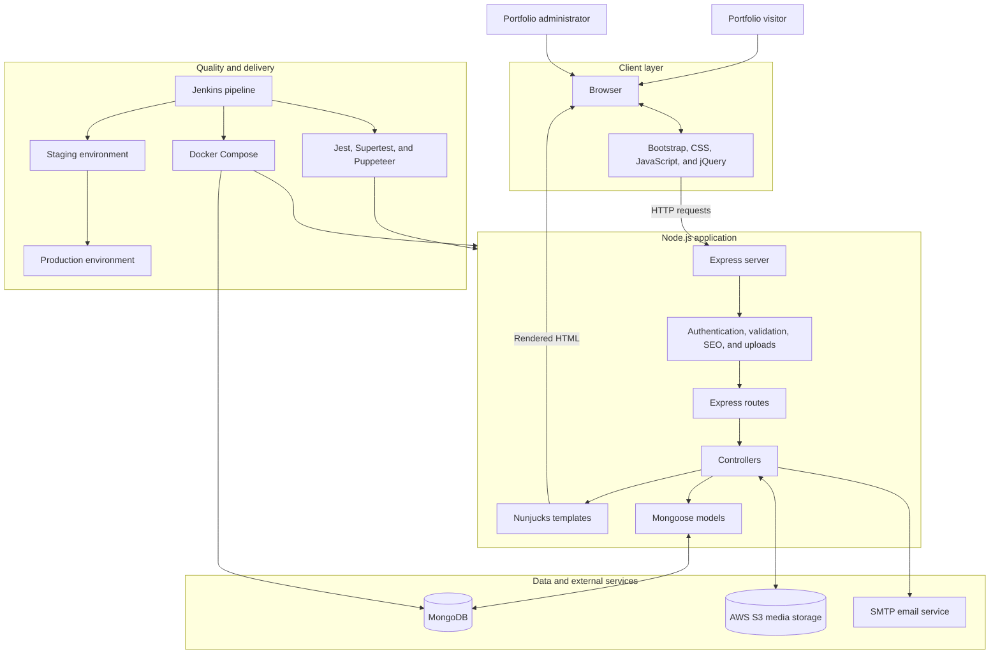

# Reusable Portfolio Platform

A reusable, database-driven portfolio and content-management platform designed to separate professional content from presentation code.

The platform allows portfolio owners to manage profiles, services, skills, specialisations, project case studies, media, and publishing workflows through a protected administration interface without editing frontend templates.

It combines full-stack application development, cloud storage, automated testing, containerised environments, and CI/CD deployment into a single production-oriented system.


## The challenge

Many developer and professional portfolio websites hard-code projects, services, skills, and other content directly into frontend templates.

This works initially, but becomes difficult to maintain as the portfolio grows. Routine updates may require:

* Editing application templates
* Modifying source code
* Rebuilding or redeploying the application
* Manually maintaining project URLs and metadata
* Managing media directly within the application
* Keeping content consistent across multiple pages

The goal of this project was to design a reusable platform where portfolio content could evolve independently from the presentation layer while retaining proper administration, testing, deployment, and production controls.

## The solution

I designed and built a full-stack portfolio management platform using Node.js, Express, MongoDB, and Nunjucks.

Instead of storing portfolio content directly inside templates, the application represents services, projects, skills, specialisations, profile information, and supporting content as structured database records.

A protected administration interface allows authorised users to create, update, order, publish, and manage this content without modifying application code.

The platform also includes:

* Structured project case studies
* Permanent project URLs
* Draft and publishing workflows
* Cloud-based media storage
* SEO metadata and structured data
* Contact enquiry management
* Automated testing
* Containerised development environments
* CI/CD workflows across development, staging, and production

Although the platform was initially created for my own professional portfolio, its architecture was deliberately designed to be reusable rather than tied to a single person's content.

## What the platform enables

The system allows a portfolio owner to:

* Manage professional content without editing templates
* Publish structured project case studies with permanent URLs
* Maintain services, skills, and specialisations from one administration interface
* Add project metrics, architecture decisions, results, and trade-offs
* Store media outside the application filesystem
* Maintain draft content before publishing
* Receive categorised enquiries through the portfolio
* Manage SEO metadata and structured search-engine information
* Validate application behaviour through automated tests
* Move changes consistently from development to staging and production

## Engineering scope

This project demonstrates experience across the complete application lifecycle:

**Solution design**

* Identifying maintainability limitations in hard-coded portfolio websites
* Separating content management from presentation
* Designing reusable publishing workflows
* Defining database models around professional content

**Full-stack development**

* Server-side application development
* Database modelling
* Authentication and administration
* Dynamic content rendering
* Form processing and validation
* Media management
* SEO implementation

**Cloud and DevOps**

* Docker-based application environments
* AWS S3 media storage
* Jenkins CI/CD pipelines
* Development, staging, and production workflows
* Automated testing
* Deployment standardisation
* Health and readiness checks


## Key capabilities

### Content management

* Reusable profile content
* Editable service-section content
* Ordered and publishable service cards
* Skills management
* Specialisation management
* Portfolio author management
* Draft and published content states

### Project case studies

Projects can contain structured information including:

* Project overview
* Challenge
* Solution
* Results
* Metrics
* Architecture notes
* Technical decisions
* Trade-offs
* Media
* Technology stack

Each published project receives a permanent slug-based URL:

```text
/portfolio/projects/{slug}
```

### Administration

The protected administration interface provides management functionality for:

* Services
* Service-section content
* Project case studies
* Skills
* Specialisations
* Portfolio authors
* Demo users

### Media

Uploaded images and videos are stored using AWS S3 rather than relying exclusively on the application filesystem.

### Contact enquiries

The application includes:

* Contact form processing
* Enquiry categorisation
* Input validation
* Basic spam protection
* SMTP-based email delivery

### SEO and analytics

The platform supports:

* Page-specific metadata
* Structured data
* Sitemap generation
* Search-engine-friendly permanent URLs
* Analytics integration

### Quality assurance

Testing includes:

* Unit tests
* Integration tests
* Browser-based end-to-end tests
* Docker-based testing environments


# Architecture



The public portfolio and administration interface share the same Express application.

Public portfolio content is rendered server-side using Nunjucks, while authentication protects content-management routes.

MongoDB stores structured portfolio data, AWS S3 stores uploaded media, and an SMTP service handles contact enquiries.

Testing and containerisation support repeatable application environments, while Jenkins manages promotion through development, staging, and production workflows.


# Key architecture decisions

## Database-driven content

Portfolio content is stored as structured MongoDB records instead of being embedded directly into frontend templates.

This separates content from presentation and allows routine portfolio updates without modifying application code.


## Server-side rendering

Nunjucks is used for server-side rendering rather than separating the system into an independent frontend SPA and backend API.

For this project's requirements, server-side rendering provides:

* Simpler deployment
* Strong SEO support
* Fewer application components
* Straightforward authentication
* Direct integration between backend content and rendered pages


## External media storage

Uploaded media is stored in AWS S3 rather than relying solely on the local application filesystem.

This makes deployments more portable and prevents uploaded content from depending on an individual application container.


## Draft and publishing workflow

Content can remain unpublished while it is being prepared.

This prevents incomplete project case studies or service descriptions from appearing publicly before they are ready.


## Structured project case studies

Projects are represented as more than simple image-and-description cards.

The data model supports structured information such as:

* Business challenge
* Technical solution
* Results
* Metrics
* Architecture
* Design decisions
* Trade-offs

This makes the portfolio suitable for communicating both technical implementation and business impact.


## Environment separation

Development, testing, staging, and production workflows are separated to reduce deployment risk and make application behaviour more predictable between environments.


# Technology stack

## Application

* Node.js
* Express
* MongoDB
* Mongoose
* Nunjucks

## Frontend

* Bootstrap
* CSS
* JavaScript
* jQuery

## Cloud and services

* AWS S3
* SMTP email service

## Testing

* Jest
* Supertest
* Puppeteer

## DevOps

* Docker
* Docker Compose
* Jenkins
* Git
* Multi-environment deployment workflows


# Project structure

```text
controllers/       Request handling and application logic
models/            Mongoose schemas and data models
routes/            Express application routes
views/             Public and administration Nunjucks templates
public/            Stylesheets, browser scripts, fonts, and static media
uploads/           Upload validation and Multer configuration
utils/             Shared database, SEO, and controller helpers
__tests__/         Unit and integration tests
__e2e__/           Browser-based end-to-end tests
jenkins-scripts/   CI/CD test and branch-promotion scripts
configs/           Environment and database configuration
```


# Requirements

To run the project locally you will need:

* Node.js 18 or newer
* npm
* MongoDB
* AWS S3 credentials if testing cloud media uploads
* SMTP credentials if testing contact-form email delivery

For the container workflow:

* Docker
* Docker Compose


# Local installation

Clone the repository and enter the project directory.

Install dependencies:

```bash
npm install
```

Configure the appropriate environment file inside:

```text
configs/
```

Ensure MongoDB is available, then start the application:

```bash
npm run devstart
```

The configured `NODE_PORT` determines the application port.


# Environment configuration

Environment files should be stored inside:

```text
configs/
```

They should not be committed to version control.

The application expects variables including:

```dotenv
NODE_PORT=
NODE_ENV=

DB_HOST=
DB_PORT=
DB_NAME=
DB_USER=
DB_PASSWORD=

TEST_NODE_PORT=
TEST_NODE_ENV=

TEST_DB_HOST=
TEST_DB_PORT=
TEST_DB_NAME=
TEST_DB_USER=
TEST_DB_PASSWORD=

BUCKET_NAME=
BUCKET_REGION=
ACCESS_KEY=
SECRET_ACCESS_KEY=

EMAIL_HOST=
EMAIL_PORT=
EMAIL_USER=
EMAIL_PASSWORD=

AUTH_SECRET_KEY=
BASEURL=
```

The application currently loads:

```text
configs/.env.prod
```

when:

```text
NODE_ENV=production
```

and:

```text
configs/.env.test
```

when:

```text
NODE_ENV=test
```

Other direct application starts use:

```text
configs/.env.stage
```

The Docker development environment additionally uses:

```text
configs/.env.dev
```


# Docker development environment

The development environment can run the application, MongoDB, and Mongo Express through Docker Compose.

Start the environment with:

```bash
docker compose -f devdocker-compose.yml up --build
```

Default development services:

```text
Portfolio
http://localhost:3001/portfolio

Mongo Express
http://localhost:8081

Health check
http://localhost:3001/portfolio/health

Readiness check
http://localhost:3001/portfolio/readiness
```

Stop the environment using:

```bash
docker compose -f devdocker-compose.yml down
```


# Testing

## Portfolio content tests

Run the lightweight content-related test suite with:

```bash
npm run test:portfolio-content
```

This covers reusable service and project case-study models and templates without requiring the complete application database environment.


## Unit and integration tests

Run the main test suite with:

```bash
npm run test:unit
```


## Docker test environment

Tests can also be executed in an isolated Docker environment:

```bash
docker compose -f testdocker-compose.yml up --build
```

The Docker testing environment exposes:

```text
Application:   3002
MongoDB:       27018
Mongo Express: 8082
```

# Administration

After creating an authorised portfolio owner account and signing in, the administration interface provides content management functionality for:

* Services
* Service-section copy
* Project case studies
* Skills
* Specialisations
* Portfolio authors
* Demo users

Service records can be ordered and saved as drafts before publication.

If no database-backed service has been published, the public homepage retains its legacy service content as a fallback.

Project case studies can also remain in draft state until they are ready to be published.

A published project requires a unique slug and becomes available at:

```text
/portfolio/projects/{slug}
```

# Health and readiness checks

The application exposes separate endpoints for operational monitoring.

Health:

```text
/portfolio/health
```

Readiness:

```text
/portfolio/readiness
```

These endpoints allow deployment infrastructure to distinguish between whether the application process is running and whether the application is ready to serve requests.

---

# Branch and deployment workflow

The main branches are:

```text
development
staging
production
```

### Development

Active application development occurs on:

```text
development
```

Completed work is pushed using:

```bash
git push origin development
```

### Staging

Validated application changes are promoted to:

```text
staging
```

for testing in an environment closer to production.

### Production

Changes that successfully complete staging validation can then be promoted to:

```text
production
```

for release.

Jenkins uses:

```text
jenkins-scripts/merge-code-step.sh
```

to promote approved application files while preserving staging-specific infrastructure and excluding development-only testing resources.

Direct local merges into `staging` should therefore be avoided unless intentionally bypassing the automated workflow.


# Database compatibility

Schema additions are designed to remain backward-compatible where possible.

MongoDB creates new service and settings collections when their first records are stored.

Existing project records do not need to be deleted when new case-study fields are introduced. They can instead be enriched gradually through the administration interface.

Database backups should be taken before substantial staging or production deployments.


# Security considerations

The project includes several controls intended for normal application security and operational hygiene:

* Protected administration routes
* Authentication-based content management
* Input validation
* Upload validation
* Environment-based secrets
* External media storage
* Separate runtime environments
* Basic contact-form spam protection

Secrets and environment files must never be committed to the repository.


# Future improvements

Potential future enhancements include:

* Role-based administration permissions
* Expanded content-version history
* Additional automated security testing
* Automated database backup workflows
* Richer analytics dashboards
* Reusable portfolio themes
* API access for external portfolio clients
* Additional deployment observability
* Improved media processing and optimisation


# What this project demonstrates

From an engineering perspective, this project demonstrates my ability to move beyond implementing isolated application features and instead design a complete technical solution.

The work involved:

* Identifying a maintainability problem
* Translating requirements into a system design
* Designing reusable data models
* Building the application and administration workflows
* Integrating external services
* Managing persistent and cloud-hosted data
* Implementing automated testing
* Containerising the application
* Designing deployment workflows
* Supporting separate development, staging, and production environments

It reflects the type of work I enjoy most: understanding an operational problem and delivering a practical solution across software engineering, infrastructure, deployment, and ongoing system operation.


# License

This repository is currently private.

An explicit licence should be added before the source code is distributed, reused, or made publicly available outside the authorised project team.
