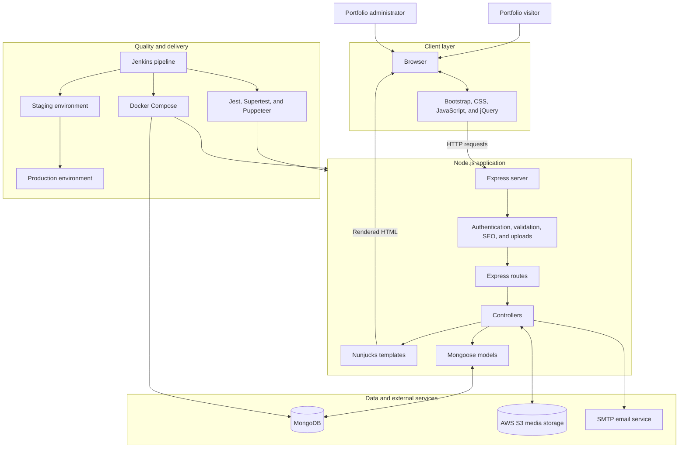

# Reusable Portfolio Platform

A database-driven portfolio and administration platform built with Express, MongoDB, Mongoose, and Nunjucks. Portfolio owners can manage their profile, services, skills, specialisations, and project case studies without changing presentation templates.

## Features

- Responsive public portfolio with reusable profile content
- Ordered, publishable service cards and editable service-section copy
- Project case studies with permanent slug URLs
- Structured metrics, results, architecture notes, decisions, and trade-offs
- Skills and specialisation management
- Contact form with enquiry categories and basic spam protection
- Protected administration interface for content management
- S3-backed image and video uploads
- SEO metadata, structured data, sitemap, and analytics support
- Unit and browser-based test suites
- Docker-based development and test environments
- Jenkins development, staging, and production workflow

## Technology

- Node.js and Express
- MongoDB and Mongoose
- Nunjucks templates
- Bootstrap, CSS, JavaScript, and jQuery
- AWS S3
- Nodemailer
- Jest, Supertest, and Puppeteer
- Docker Compose and Jenkins

## Stack architecture



The public portfolio and administration interface share the same Express application. Authentication protects content-management routes, while published portfolio content is rendered server-side with Nunjucks. MongoDB stores structured content, S3 stores uploaded media, and the SMTP service delivers contact enquiries.

## Project structure

```text
controllers/       Request handling and application logic
models/            Mongoose schemas
routes/            Express routes
views/             Nunjucks public and admin templates
public/            Stylesheets, browser scripts, fonts, and static media
uploads/           Upload validation and Multer configuration
utils/             Shared database, SEO, and controller helpers
__tests__/         Unit and integration tests
__e2e__/           Browser-based tests
jenkins-scripts/   CI test and branch-promotion scripts
configs/           Environment and database configuration
```

## Requirements

- Node.js 18 or newer
- npm
- MongoDB
- AWS S3 credentials for uploaded media
- SMTP credentials for the contact form
- Docker and Docker Compose for the container workflow

## Environment configuration

Environment files belong in `configs/` and must not be committed. The application uses the following variables:

```dotenv
NODE_PORT=
NODE_ENV=

DB_HOST=
DB_PORT=
DB_NAME=
DB_USER=
DB_PASSWORD=

TEST_NODE_PORT=
TEST_NODE_ENV=
TEST_DB_HOST=
TEST_DB_PORT=
TEST_DB_NAME=
TEST_DB_USER=
TEST_DB_PASSWORD=

BUCKET_NAME=
BUCKET_REGION=
ACCESS_KEY=
SECRET_ACCESS_KEY=

EMAIL_HOST=
EMAIL_PORT=
EMAIL_USER=
EMAIL_PASSWORD=

AUTH_SECRET_KEY=
BASEURL=
```

The current environment loader expects:

- `configs/.env.prod` when `NODE_ENV=production`
- `configs/.env.test` when `NODE_ENV=test`
- `configs/.env.stage` for other direct application starts

The Docker development stack additionally reads `configs/.env.dev`.

## Local installation

Install dependencies:

```bash
npm install
```

Make sure MongoDB is available and the appropriate environment file exists, then start the development server:

```bash
npm run devstart
```

The configured `NODE_PORT` determines the application URL. The Docker development configuration exposes the application at `http://localhost:3001`.

## Docker development

Start the application, MongoDB, and Mongo Express:

```bash
docker compose -f devdocker-compose.yml up --build
```

Default development endpoints:

- Portfolio: `http://localhost:3001/portfolio`
- Mongo Express: `http://localhost:8081`
- Health check: `http://localhost:3001/portfolio/health`
- Readiness check: `http://localhost:3001/portfolio/readiness`

Stop the stack:

```bash
docker compose -f devdocker-compose.yml down
```

## Testing

Run the lightweight portfolio content tests:

```bash
npm run test:portfolio-content
```

This command covers the reusable service and project case-study models and templates without requiring a running application database.

Run the main unit and integration suite:

```bash
npm run test:unit
```

Run tests using Docker:

```bash
docker compose -f testdocker-compose.yml up --build
```

The Docker test environment exposes the test application on port `3002`, MongoDB on `27018`, and Mongo Express on `8082`.

## Administration

After creating an owner account and signing in, the administration dashboard provides content management for:

- Services and service-section copy
- Project case studies
- Skills
- Specialisations
- Portfolio authors
- Demo users

Service records can be ordered and saved as drafts before publication. If no database-backed service has been published, the public homepage retains its legacy service content as a fallback.

Project case studies can also remain drafts. A published case study requires a unique slug and is available at:

```text
/portfolio/projects/{slug}
```

## Branch and deployment workflow

The primary branches are:

- `development` for active application work
- `staging` for validation and staging deployment
- `production` for production deployment

Push completed work to `development`:

```bash
git push origin development
```

Jenkins uses `jenkins-scripts/merge-code-step.sh` to promote allowed application files while preserving staging-only infrastructure and excluding development-only test resources. Avoid a direct local merge into `staging` unless intentionally bypassing that workflow.

## Database compatibility

Schema additions are designed to be backward-compatible. MongoDB creates the service settings and service collections when their first records are saved. Existing projects do not need to be deleted or rewritten; they can be enriched gradually through the administration interface.

Back up staging and production databases before substantial deployments as a normal operational precaution.

## License

This repository is private. Add an explicit licence before distributing or reusing it outside the authorised project team.
